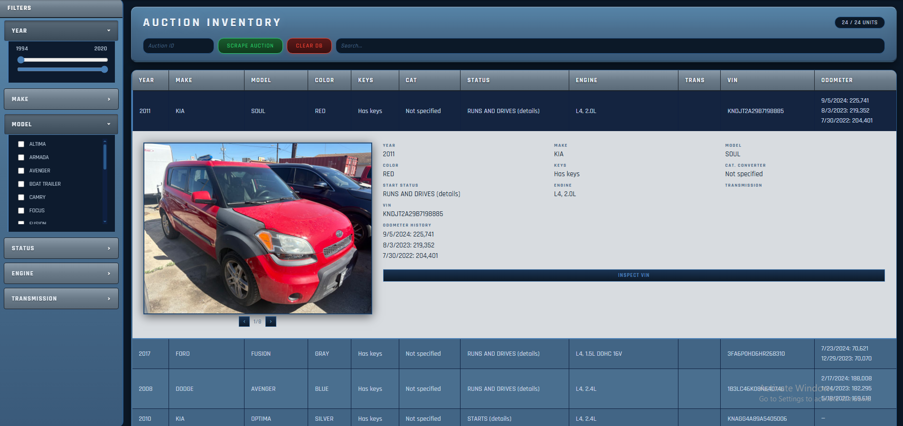

# AuturaExtractor



A full-stack vehicle auction intelligence tool that scrapes Autura Marketplace, displays live inventory in a custom dashboard, and cross-references each vehicle against Texas DMV inspection history for mileage verification.

---

## Tech Stack

| Layer | Technology |
|---|---|
| Backend | Python, FastAPI |
| Automation | Playwright (Chromium) |
| Database | SQLite3 |
| Frontend | React (Vite) |
| Styling | Custom CSS3 (Rajdhani, design token system) |

---

## Key Features

- **Async Scraping** — FastAPI BackgroundTasks runs scrapers without blocking the UI, with a live status endpoint polled every 2 seconds
- **Infinite Scroll Handling** — Playwright scrolls auction pages to bypass the 30-vehicle cap and capture full inventory
- **Image Scraping** — Pulls full-resolution gallery images per vehicle and displays them in a cycling viewer with lightbox support
- **Anti-Bot Bypass** — Handles Cloudflare Turnstile and ASP.NET session state for the Texas DMV inspection portal
- **Inspection History** — Cross-references each VIN against MyTxCar to pull historical odometer readings, deduplicating by year
- **Sidebar Filters** — Filter inventory by year range, make, model, start status, engine type, and transmission in real time
- **Expandable Rows** — Click any vehicle row to expand a detail panel with full specs, image cycler, and a one-click inspection scrape

---

## Installation & Setup

### Backend
```bash
cd backend
pip install -r requirements.txt
uvicorn main:app --reload
```
The API runs at `http://127.0.0.1:8000` and auto-initializes the database on first launch.

### Frontend
```bash
cd autura-frontend
npm install
npm run dev
```
The dashboard runs at `http://localhost:5173`.

---

## Project Structure

```
AuturaExtractor/
├── backend/
│   ├── main.py               # FastAPI routes and database management
│   ├── scraper.py            # Autura Marketplace scraping logic
│   ├── inspectionscrape.py   # Texas DMV / MyTxCar inspection history engine
│   └── requirements.txt
└── autura-frontend/
    ├── src/
    │   ├── App.jsx           # Main React component and UI logic
    │   └── App.css           # Full design token system and component styles
    └── public/
```
